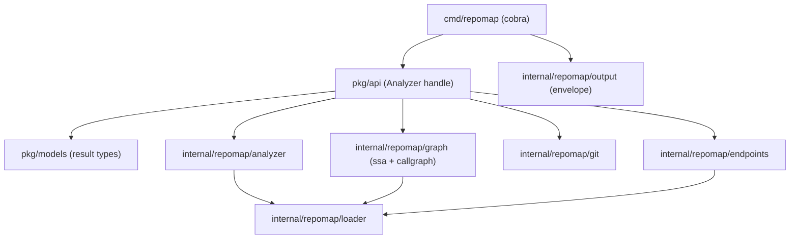

# Architecture

`repomap` is deliberately structured so the CLI is a thin adapter over reusable
Go libraries. Business logic lives in packages; `cmd/repomap` only parses flags,
calls `pkg/api`, and marshals the result. This keeps a future MCP server (or any
other adapter) a pure front-end over the same library.

## Design rules

1. **`pkg/api` returns typed structs from `pkg/models`, never JSON bytes.** The
   `{"schema":"repomap.v1",...}` envelope is applied only by the CLI, so any other
   caller reuses the same API without re-parsing.
2. **`api.New(ctx, opts...)` returns an `Analyzer` handle** that caches the loaded
   package graph across queries. Free functions would force a long-lived server to
   reload on every call.
3. **Typed errors live in the library** (`internal/repomap/rerr`, re-exported as
   `api.Error`/`api.ErrorCode`). The CLI maps them to the
   `{"ok":false,"error":{...}}` envelope and to process exit codes.

## Determinism

Determinism is a hard requirement: the same input and command always produce
byte-identical output, on every OS. It is encoded once and enforced with golden
tests.

- Every slice is sorted by a stable key before marshaling; Go map iteration order
  never reaches output.
- Paths are relative to the module root and `filepath.ToSlash`-normalized, so
  Windows and macOS produce identical bytes.
- No absolute paths, timestamps, or durations appear in `result` payloads.

## Load tiers (performance)

`internal/repomap/loader` wraps `golang.org/x/tools/go/packages` and exposes
explicit `LoadMode` tiers. The syntax/type commands (`overview`, `package`,
`symbol`, `struct`, `deps`) use a shallow mode; only the graph commands
(`callers`, `tests`, `impact`) pay for full type-checking and SSA. This is the
main lever for the sub-100ms budget on cached metadata queries, guarded by a
performance test.

## Package layout

| Path | Responsibility |
| --- | --- |
| `cmd/repomap` | Cobra commands, flag parsing, exit-code propagation. |
| `pkg/api` | Public `Analyzer` handle; one method per command. |
| `pkg/models` | Stable serializable result types (the `repomap.v1` contract). |
| `internal/repomap/loader` | `packages.Load` wrapper with tiered `LoadMode` + caching. |
| `internal/repomap/analyzer` | Syntax/type-tier commands. |
| `internal/repomap/graph` | SSA + call-graph commands. |
| `internal/repomap/endpoints` | Pluggable route detectors + upstream detection. |
| `internal/repomap/git` | Minimal read-only git interaction. |
| `internal/repomap/output` | Envelope, deterministic marshal, text renderer, exit codes. |
| `internal/repomap/rerr` | Dependency-free typed error leaf package. |
| `internal/version` | Version via ldflags with `ReadBuildInfo` fallback. |

## Extending route detection

`endpoints` defines a `RouteDetector` interface and a registry of built-in
detectors. Supporting a new framework means implementing the interface and
registering it; no other package changes.
